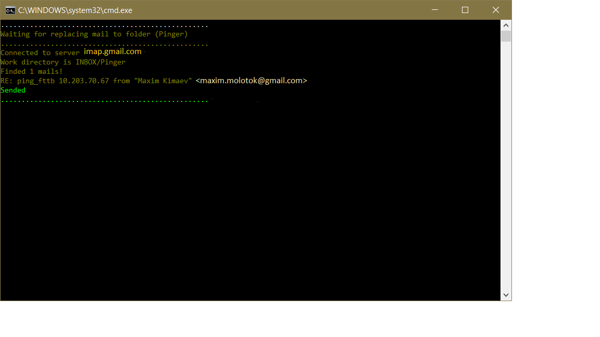
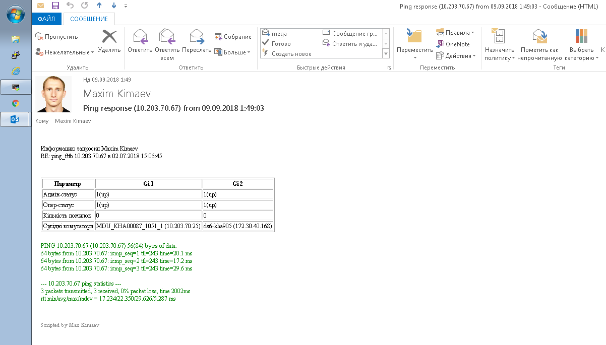

# AutoPinger
This application checks your email, processes need information from request and sends to you specific information about your network node (IP). All application settings are configurated with userSetting.xml

<h3>Finding emails...</h3>

  

<h3>Result</h3>

  

